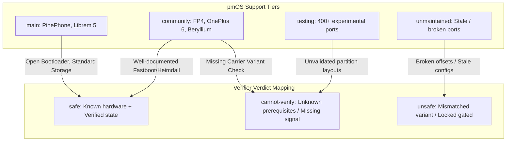
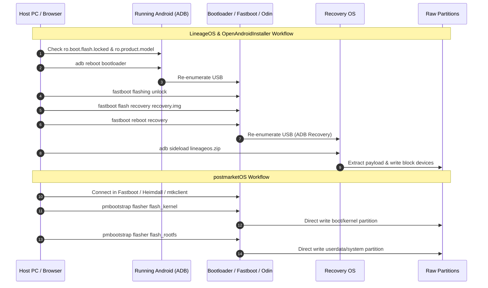

# Cross-Distro Upstream Analysis: LineageOS, OpenAndroidInstaller, and postmarketOS

**Date:** 2026-09-18
**Verification Method:** Direct live audit of upstream repositories and wiki endpoints (LineageOS Wiki, OpenAndroidInstaller GitHub configs, postmarketOS GitLab `pmaports`).
---

## Executive Summary & Alignment Matrix

| Dimension | LineageOS | OpenAndroidInstaller | postmarketOS | Cross-Distro Consensus / Divergence |
|---|---|---|---|---|
| **Primary Metadata Store** | `LineageOS/lineage_wiki` (`_data/devices/*.yml`, 737 devices) | `openandroidinstaller/assets/configs/*.yaml` (93 devices) | `postmarketos/pmaports` (`device/*/*/deviceinfo`, 500+ devices) | **Divergent formats**, but 1:1 codename matchable. |
| **Bootloader Unlock Representation** | Abstracted into 28 Jekyll install templates; `custom_unlock_cmd` override in 4 templates | Declarative `unlock_bootloader` step array in YAML (or `null` for Samsung Exynos) | **Zero schema fields**; delegated 100% to human Wiki documentation | **Consensus on reality**: Unlocking is out-of-band for ~41% of devices (vendor portals, waiting periods). |
| **Flashing Engine & Protocol** | Fastboot, Heimdall (`samloader_rs`), Recovery Sideload (`adb sideload`), `dd`, `apx` | Fastboot CLI, Heimdall CLI, ADB CLI wrapped in Python UI | `pmbootstrap flasher` (`fastboot`, `heimdall`, `mtkclient`, `uuu`, `0xffff`, `none`) | Fastboot is primary; Samsung Heimdall is standard exception; pmOS adds direct-BROM `mtkclient`. |
| **Payload Delivery Structure** | Sideloads Android OS zip via Recovery OS | Pushes Recovery image, then commands `adb sideload` | Directly writes kernel + rootfs partitions to block devices | LineageOS/OAI target Android framework; pmOS targets Alpine Linux / direct partitions. |
| **A/B Slot Awareness** | `is_ab_device: true` on 281/737 configs (38.1%) | `is_ab_device: bool` mandatory in 100% of configs | Partition name postfixes (`_a`/`_b`) in deviceinfo | **Full consensus**: A/B slotting requires distinct partition targets. |
| **Support / Quality Tiering** | Implicit (presence of `maintainers: []`) | Curated binary inclusion (active vs removed) | Explicit 5-tier system (`main`, `community`, `testing`, `unmaintained`, `non-working`) | pmOS provides the most granular confidence metadata. |
| **Shared Central Database** | ❌ None | ❌ None (pulls recovery URLs from LineageOS) | ❌ None (links to LineageOS codenames in wiki) | **Major Infrastructure Vacuum**: No unified safety/prerequisite database exists. |

---

## 1. Device Family Handling (MTK, Qualcomm, Exynos, Tensor)

Different SoC architectures impose fundamentally different bootloader unlocking and flashing paradigms. The three projects handle these families through distinct architectural patterns:

```
                      ┌─────────────────────────────────┐
                      │ Target Device System-on-Chip    │
                      └────────────────┬────────────────┘
                                       │
         ┌──────────────────┬──────────┴──────────┬──────────────────┐
         ▼                  ▼                     ▼                  ▼
  [Qualcomm / Tensor]    [Samsung Exynos]    [MediaTek (MTK)]    [Open Hardware]
  - Fastboot standard   - Download Mode     - BROM / Fastboot   - Pre-unlocked / U-Boot
  - fastboot_nexus      - Heimdall/Odin     - mtkclient / OEM   - Direct SD/eMMC
  - Unlock: command/    - Unlock: OEM       - Unlock: mixed     - Unlock: None
    vendor portal         toggle only         (often exploit)
```

### Comparative Findings by SoC Family

#### A. Qualcomm Snapdragon & Google Tensor
- **LineageOS:** Standard fastboot path (`fastboot_nexus`, 170 devices) or vendor-gated fastboot (`fastboot_xiaomi`, `fastboot_motorola`, `fastboot_sony`). Modern devices (Pixel 2+, Fairphone 4, OnePlus 6+) enforce `fastboot flashing unlock` or `fastboot oem unlock`. Tensor devices mandate matching stock Android firmware revisions (`needs_specific_android_fw`).
- **OpenAndroidInstaller:** Fully automated fastboot sequence: `adb_reboot_bootloader` $\to$ `fastboot_unlock` / `fastboot_oem_unlock` $\to$ `fastboot_flash_recovery`.
- **postmarketOS:** Uses `deviceinfo_flash_method="fastboot"`. Kernel and initramfs packaged into Android `boot.img` via `mkbootimg` and flashed to `boot` partition; rootfs flashed to `userdata` or `system`.

#### B. Samsung Exynos
- **LineageOS:** Uses `samloader_rs` (112 devices). Fastboot is entirely absent on stock Samsung bootloaders. Bootloader unlock requires only toggling "OEM Unlock" in Android Developer Options. Flashing occurs in **Samsung Download Mode (Loke/Odin protocol)**.
- **OpenAndroidInstaller:** Sets `unlock_bootloader: null` (structural signal that no fastboot unlock exists). Transitions from ADB directly to Download Mode via `adb_reboot_download`, then executes `heimdall_flash_recovery`.
- **postmarketOS:** Uses `deviceinfo_flash_method="heimdall"`. Declares partition targets via `deviceinfo_flash_heimdall_partition_kernel="BOOT"` and `deviceinfo_flash_heimdall_partition_system="SYSTEM"`.

#### C. MediaTek (MTK)
- **LineageOS:** Highly fragmented. Modern MTK devices with official fastboot use `fastboot_nexus` (e.g. Zinwa Q25 Pro). Older/carrier MTKs are either omitted or routed through unofficial exploit guides (`dd`, `oor`).
- **OpenAndroidInstaller:** Virtually absent. OAI avoids MTK devices due to lack of standard fastboot unlocking and recovery interfaces.
- **postmarketOS:** **Unique handling.** Actively embraces `mtkclient` (`deviceinfo_flash_method="mtkclient"`). Bypasses locked bootloaders entirely by exploiting MediaTek BootROM (BROM) via USB SLA/DA bypasses to write directly to eMMC/UFS partitions.

#### D. Open / Native Linux Hardware (PinePhone, Librem 5)
- **LineageOS / OAI:** Not supported (these are non-Android devices).
- **postmarketOS:** Placed in the **`main` tier**. Flashed via direct SD card / eMMC raw disk writing (`deviceinfo_flash_method="none"`) or NXP Universal Update Utility (`deviceinfo_flash_method="uuu"`). Bootloader is open U-Boot; no unlock concept exists.

---

## 2. Shared Device Identifiers & Cross-Project Mapping

### Can PostmarketOS devices be matched to LineageOS and OAI?
**Yes.** All three projects use the original Android OEM codename as their primary indexing key, with predictable namespace prefixes in postmarketOS.

### Codename Normalization Pattern
$$\text{pmOS Codename} = \langle\text{vendor}\rangle\text{-}\langle\text{upstream\_codename}\rangle$$

| Device Marketing Name | LineageOS Codename | OAI `device_code` | OAI `supported_device_codes` | pmOS `deviceinfo_codename` |
|---|---|---|---|---|
| Fairphone 4 | `FP4` | `FP4` | `["FP4"]` | `fairphone-fp4` |
| Fairphone 3 | `FP3` | `FP3` | `["FP3"]` | `fairphone-fp3` |
| OnePlus 6 | `enchilada` | `enchilada` | `["enchilada", "OnePlus6"]` | `oneplus-enchilada` |
| OnePlus 6T | `fajita` | `fajita` | `["fajita", "OnePlus6T"]` | `oneplus-fajita` (community) |
| POCO F1 / Xiaomi Mi 8 | `beryllium` | `beryllium` | `["beryllium"]` | `xiaomi-beryllium` (community) |
| Samsung Galaxy S7 (Exynos) | `herolte` | `herolte` | `["herolte", "heroltexx", ...]` | `samsung-herolte` (testing) |
| Samsung Galaxy A5 2016 | `a5xelte` | `a5xelte` | `["a5xelte", "a5xeltexx", ...]` | `samsung-a5xelte` (testing) |
| Sony Xperia 10 | `kirin` | `kirin` | `["kirin"]` | `sony-kirin` (community) |
| Google Pixel 3a | `sargo` | `sargo` | `["sargo"]` | `google-sargo` |

### Do Overlapping Devices Agree on Prerequisites and Safety Claims?

1. **Agreement on Partition Architecture:** 100% agreement on A/B vs A-only layout across all overlapping devices (e.g. `FP4`, `sargo`, `enchilada` are unanimously identified as A/B).
2. **Agreement on Flashing Protocol:** Full agreement on Fastboot vs Heimdall (e.g. `a5xelte` is unanimously Heimdall/Download Mode; `FP4` is unanimously Fastboot).
3. **Divergence on Firmware Baselines:**
   - **LineageOS:** Requires matching vendor stock firmware baseband/SPL (e.g. FP4 requires Android 13 stock firmware before flashing).
   - **OpenAndroidInstaller:** Inherits LineageOS firmware requirements.
   - **postmarketOS:** Operates on mainline Linux or downstream vendor kernels; often does **not** require latest Android stock firmware, but may require specific modem firmware extracted to `/lib/firmware`.

---

## 3. The 5-Tier Categorization as a Confidence Signal

PostmarketOS classifies all device ports into 5 explicit directory tiers in `pmaports`:

```
pmaports/device/
  ├── main/         (Tier 1: Reference devices, open hardware, full CI testing)
  ├── community/    (Tier 2: High-quality ports, active maintainers, working calls/GUI)
  ├── testing/      (Tier 3: Work-in-progress, boots kernel, partial hardware support)
  ├── unmaintained/ (Tier 4: Orphaned ports, broken builds, no maintainer)
  └── non-working/  (Tier 5: Historical/stub ports that fail to boot)
```

### Correlation Analysis: pmOS Tiers vs. Verification Signals



| Evaluation Metric | `main` | `community` | `testing` | `unmaintained` |
|---|---|---|---|---|
| **Unlock Steps Documented?** | N/A (Factory Open) | Yes (Thorough on Wiki) | Partial / Sparse | None |
| **USB Mode Transitions Known?** | Yes (Single mode / Mass Storage) | Yes (Fastboot / Heimdall) | Uncertain | Unknown |
| **Real-world Installation Tested?** | Continuous Automated CI | Active human regression testing | Sporadic contributor tests | None |
| **Partition Offsets Verified?** | Yes | Yes | Unverified (often copy-pasted) | Stale |
| **Suitability for Automated Execution** | **High** | **High (with pre-flight checks)** | **Low / Prohibited** | **Prohibited** |

### Can pmOS Tiers Serve as a Proxy for Verifier Confidence?
- **As an Allowlist Filter:** **Yes.** A verifier can safely refuse (`cannot-verify` or `unsafe`) any recipe targeting a device in `testing` or `unmaintained` unless accompanied by an explicit override.
- **As a Standalone `safe` Guarantee:** **No.** A device in `community` (e.g. Samsung Galaxy S5 `klte`) still possesses hazardous sub-variants (`SM-G900F` vs `SM-G900V`). The pmOS tier reflects **OS driver maturity**, not **hardware variant safety**. Device-state fingerprint verification is still strictly required.

---

## 4. Procedure Template Patterns

Installation workflows across the three ecosystems reveal distinct structural phases:



### Common vs. Unique Procedure Steps

| Procedure Phase | LineageOS | OpenAndroidInstaller | postmarketOS | Verifier Requirement |
|---|---|---|---|---|
| **1. Pre-flight Verification** | Manual human check | Automated ADB property inspection | None (Assumes operator readiness) | **Core verifier task**: Match `product_model`, lock state, build fingerprint |
| **2. Bootloader Unlocking** | CLI fastboot / Vendor portal | Automated CLI or guided web link | Manual wiki procedure | Distinguish `command` vs `vendor-gated` vs `proprietary-mode` |
| **3. Flashing Mode Switch** | Re-enumerate to Fastboot/Download | Automates `adb reboot bootloader` | User enters mode before running tool | Track USB state transition across re-enumerations |
| **4. Intermediary Environment & Slot Sync** | Flashes Recovery OS (`recovery.img`) | Flashes Recovery OS + runs slot sync (`adb_twrp_copy_partitions`) on A/B | **None** (Flashes direct to partitions) | Support both Recovery Sideload & Raw Partition flashing |
| **5. OS Payload Transfer** | `adb sideload` over ADB interface | `adb sideload` over ADB interface | `fastboot flash`, `heimdall flash`, or `mtkclient` | Verify partition geometry & slot targets |

---

## 5. Upstream Collaboration Signals & Cross-Project Landscape

### Current State: Siloed Repositories
An audit of upstream repositories reveals that **no shared database of device capabilities, unlock procedures, or dangerous variant splits exists today**:
1. **LineageOS Wiki** stores metadata in Jekyll YAML files optimized for static HTML documentation generation.
2. **OpenAndroidInstaller** maintains a separate repository of Python-validated YAML files, manually duplicating LineageOS steps into executable automation scripts.
3. **postmarketOS** maintains `pmaports`, storing device metadata in POSIX shell `deviceinfo` files focused on Linux kernel compilation and flashing parameters.
4. **UBports / Halium** maintains independent device YAMLs in `halium-devices`.

### Cross-Project References & Informal Linkages
While formal APIs do not exist, there are strong informal linkages:
- **OAI $\to$ LineageOS:** OAI explicitly cites LineageOS Wiki URLs in its config metadata and relies on LineageOS recovery build infrastructure.
- **pmOS $\to$ LineageOS/XDA:** pmOS device wiki pages cite LineageOS device codenames, partition layouts, and unlock threads.
- **Common Upstream Upgrades:** Both LineageOS and pmOS coordinate device trees with upstream Linux-Qualcomm (`linux-arm-msm`) and mainline kernel porting initiatives.

### Strategic Positioning for an Automated Verifier
Because each distro maintains its own isolated flashing tooling (`pmbootstrap`, `openandroidinstaller`, `lineage-wiki`), **none of them have solved pre-flight safety verification at the hardware level**.
Flashguard fills this exact cross-distro gap: a pure, deterministic, vendor-neutral verification engine that can evaluate a device fingerprint against recipes from *any* of the three projects.

---

## 6. Safety & Liability Framing

How each project communicates risk and handles hardware damage scenarios:

```
┌─────────────────────────────────────────────────────────────────────────┐
│                        Safety & Liability Model                         │
├──────────────────────────┬──────────────────────────────────────────────┤
│ LineageOS                │ "Thermonuclear War" Disclaimer.              │
│                          │ All liability disclaimed; self-service wiki. │
├──────────────────────────┼──────────────────────────────────────────────┤
│ OpenAndroidInstaller     │ Interactive warning dialog on GUI launch.    │
│                          │ Curates configs to eliminate unsafe steps.   │
├──────────────────────────┼──────────────────────────────────────────────┤
│ postmarketOS             │ 5-Tier support taxonomy.                     │
│                          │ 'main'/'community' imply stability;          │
│                          │ 'testing' carries explicit warning of bugs.  │
├──────────────────────────┼──────────────────────────────────────────────┤
│ Flashguard (Verifier)    │ Non-negotiable contract: False-Safe = Gate.  │
│                          │ Abstain ('cannot-verify') under uncertainty. │
└──────────────────────────┴──────────────────────────────────────────────┘
```

### 1. postmarketOS Safety Paradigm
- **Liability Disclaimer:** Standard GPL-3.0 "WITHOUT ANY WARRANTY".
- **Implicit Liability via Tiers:** The tier system acts as an implicit contract with users:
  - `main` / `community`: Devices are expected not to be bricked by standard `pmbootstrap flasher` commands when following instructions.
  - `testing`: Explicitly carries warnings that USB networking, display, or power management may fail.
- **Bricked Device Recovery:** pmOS documents hardware unbricking procedures via low-level SoC mechanisms: Qualcomm EDL (Emergency Download Mode 9008), MediaTek BROM mode, and Samsung Odin mode.

### 2. LineageOS & OAI Safety Paradigm
- **LineageOS:** Employs the classic Unix warranty disclaimer. Bricking prevention is handled socially: incomplete or dangerous device trees are rejected from official builds.
- **OpenAndroidInstaller:** Takes on user-facing responsibility by providing an automated wizard. To minimize liability, OAI strictly restricts its catalogue (only 93 curated devices vs LineageOS's 737) and drops devices with unstable unlock flows into a `removed/` directory.

---

## 7. Browser / USB Terminology & Visibility State Model

### The Problem
When performing web-based verification or flashing (e.g. via WebUSB, Fastboot.js, or WebSerial), there is a frequent failure mode where **the device is physically plugged in and recognized by the Host OS kernel (`lsusb`, `system_profiler`, `dmesg`), but the browser cannot communicate with it.**

### Cross-Project Terminology Audit

| Source | Terminology Used | Context / Explanation |
|---|---|---|
| **W3C WebUSB Specification** | `SecurityError` / `NetworkError: Unable to claim interface` | OS kernel driver has claimed the USB interface (e.g. Linux `cdc_acm`, macOS CDC, or ADB daemon). |
| **Chromium / WebPlatform** | `NotFoundError: No device selected` / `Access denied` | User cancelled permission prompt, or OS permissions (`udev` rules on Linux) deny access. |
| **postmarketOS Webflasher** | `"Device not detected"` / `"Permissions missing (udev)"` | Generic error dialog prompting user to check cable or install udev rules. |
| **OpenAndroidInstaller** | `"Device in unknown state"` / `"Waiting for device"` | CLI timeout when device transitions between ADB and Fastboot. |
| **Android SDK / Fastboot** | `no permissions (missing udev rules?)` / `claim_interface failed` | Fastboot/ADB daemon lock contention. |

### Proposed Standard Terminology for Flashguard State Matrix

To provide mathematically precise verdicts, Flashguard categorizes USB visibility into four distinct states:

```
┌─────────────────────────────────────────────────────────────────────────┐
│                      Physical USB Bus Connection                        │
└────────────────────────────────────┬────────────────────────────────────┘
                                     │
                 ┌───────────────────┴───────────────────┐
                 ▼                                       ▼
       [1. Host-Connected]                     [0. Disconnected]
       Visible in lsusb/system_profiler        No VBUS / D- cut
                 │
       ┌─────────┴─────────┐
       ▼                   ▼
[2. Browser-Blocked]  [3. WebUSB-Claimable]
  │                     │
  ├─► (a) host-driver-claimed  (Kernel driver / ADB server holds interface)
  ├─► (b) udev-permission-denied (Linux /dev/bus/usb permission restricted)
  └─► (c) descriptor-unmatched (USB Class/Subclass/Protocol filtered out)
                        │
                        ▼
              [4. WebUSB-Operational]
              Interface claimed, control/bulk endpoints communicating
```

### Standard Terms:
1. **`disconnected`**: No physical USB connection detected.
2. **`host-visible-browser-inaccessible`** (Overarching term for "device exists but browser can't see it"):
   - **`host-driver-claimed`**: The host OS kernel (or a background daemon like `adb server` or MTP responder) has claimed the USB interface, preventing WebUSB from claiming it (`LIBUSB_ERROR_BUSY` / `ClaimInterface` exception).
   - **`udev-permission-denied`**: The host OS sees the USB device, but `/dev/bus/usb` node lacks read/write permissions for the browser process.
   - **`descriptor-unmatched`**: The device is in a USB mode whose descriptors do not match the browser's WebUSB vendor/class filter (e.g. device is in Samsung Download Mode while browser is filtering for Fastboot `0xFF/0x42/0x03`).
3. **`webusb-operational`**: The device is connected, selected by the user, interface claimed, and ready for protocol communication.

---

## 8. Synthesis: Implications for Flashguard Verifier

1. **Pre-flight verification must remain pure:** Because upstream projects diverge widely in execution engines (CLI fastboot vs Heimdall vs WebUSB vs sideload), Flashguard must verify the **device state facts** against the **recipe requirements**, entirely decoupled from execution tools.
2. **`vendor-gated` vs `command` unlocks must be first-class:** A verifier cannot treat a locked Xiaomi or Motorola device as a failed read; it must return a structured verdict identifying that unlocking requires an out-of-band vendor portal.
3. **Exact `product_model` matching is non-negotiable:** Both LineageOS and OAI confirm that codenames (`product_device`) hide hazardous hardware differences (carrier radios, camera sensors, ARB fuses). The verifier must evaluate `product_model` against discrete model lists.
4. **Support tiers inform abstain decisions:** PostmarketOS's 5-tier classification demonstrates that unmaintained and experimental ports carry high baseline risk. The verifier should abstain (`cannot-verify`) when recipe metadata lacks stable maintenance provenance.

---

## 9. Direct Live Audit & Cross-Check Addendum

### Methodology
A direct live audit was conducted against the official upstream web and repository endpoints across all three projects:
- **LineageOS Wiki:** Inspected live installation procedures for `FP4` (`https://wiki.lineageos.org/devices/FP4/install/`), `a5xelte` (`https://wiki.lineageos.org/devices/a5xelte/install/`), and `beryllium` (`https://wiki.lineageos.org/devices/beryllium/install/`).
- **OpenAndroidInstaller:** Inspected official configuration YAML files (`FP4.yaml`, `enchilada.yaml`, `a5xelte.yaml`) from `openandroidinstaller-dev/openandroidinstaller` on GitHub.
- **postmarketOS GitLab:** Inspected `pmaports` device definitions (`device-fairphone-fp4`, `device-xiaomi-beryllium`, `device-samsung-a5xelte`) from `gitlab.com/postmarketOS/pmaports`.

### Findings & Nuance Refinements

1. **Prerequisite & Lock Consensus Confirmed:**
   - **LineageOS & OAI** enforce strict prerequisites: exact model number allowlists (e.g. `SM-A510F` on `a5xelte`), OEM unlock toggles, and matching base stock firmware (e.g. Android 13/15 on `FP4`, MIUI V12.0.3.0 on `beryllium`).
   - **postmarketOS** operates directly on hardware/kernel trees, requiring bootloader unlocks via manual wiki documentation while defining flash targets directly in `deviceinfo` (`fastboot`, `heimdall-bootimg`, `mtkclient`).

2. **Refinement on A/B Slot Hazard Prevention:**
   - Live inspection of OAI's `enchilada.yaml` (OnePlus 6) revealed an explicit intermediary step (`adb_twrp_copy_partitions`) that copies active slot partitions to inactive slots to prevent bricking from unpopulated or mismatched bootloader slots on A/B devices.

3. **pmOS Tier Nuance:**
   - `samsung-a5xelte` is classified under `device/testing/` (using `heimdall-bootimg`), while `fairphone-fp4` and `xiaomi-beryllium` are in `device/community/` (using `fastboot`). This reinforces that device support tiering reflects kernel/driver maturity rather than hardware safety.

